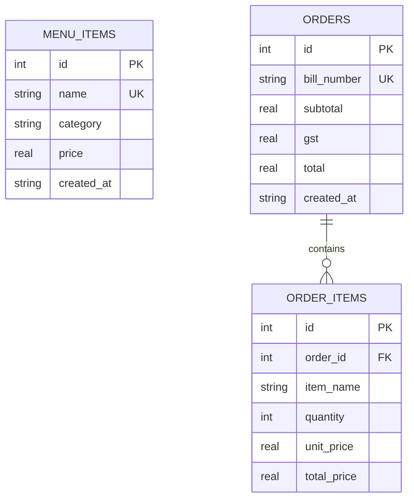

# Academic Project Report: Restaurant Billing System Using Python

---

## 1. Project Abstract

In contemporary restaurant management and food retail, automated Point-of-Sale (POS) systems are indispensable for expediting customer transactions, eliminating calculation discrepancies, enforcing statutory tax compliance (such as Goods and Services Tax - GST), and maintaining tamper-proof financial archives. Manual billing methods suffer from human calculation errors, slow order turnaround times, inventory discrepancies, and cumbersome bookkeeping.

This project presents the **Restaurant Billing System ("Foodie Corner")**, a desktop-based Point of Sale (POS) and invoicing software developed using Python 3, CustomTkinter, and SQLite. The application delivers a high-DPI, user-friendly graphical interface tailored for restaurant cashiers and managers. Key capabilities include a real-time operational dashboard, digital menu management with full CRUD features, dual-pane interactive ordering, precise monetary calculations via Python's `Decimal` arithmetic engine, automated 5% GST computation, persistent relational storage with cascading foreign keys, and multi-format receipt exportation (ASCII text and formatted PDF invoices via ReportLab).

---

## 2. Problem Statement

Small to medium-sized dining establishments, quick-service cafes, and fast-food eateries frequently grapple with the following challenges:

1. **Arithmetic Errors and Rounding Drift:** Traditional manual tallying or naive floating-point software implementations introduce rounding discrepancies in line items, subtotal aggregation, and percentage-based taxes.
2. **Operational Latency:** Manual bill preparation during peak lunch or dinner hours creates long waiting queues, degrading customer satisfaction.
3. **Lack of Dynamic Catalog Management:** Dish availability, seasonal additions, and price revisions are hard to manage without software assistance.
4. **Poor Audit Trails and Historical Records:** Paper receipts get misplaced or destroyed, making daily revenue audits and sales reconciliation tedious and error-prone.
5. **High Software Cost and Bloat:** Commercial POS solutions often demand continuous subscription fees, proprietary hardware, and constant internet connectivity.

The **Foodie Corner Restaurant Billing System** resolves these pain points through a lightweight, zero-dependency serverless architecture running natively on standard desktop workstations.

---

## 3. Project Objectives

The primary engineering and educational objectives of this application are:

* **Automate Order Processing:** Accelerate customer ordering through a dual-pane graphical interface with 1-click addition, quantity modification, and automatic item merging.
* **Guarantee Mathematical Accuracy:** Eliminate IEEE-754 floating-point rounding bugs by enforcing Python `decimal.Decimal` calculations across item totals, subtotals, GST, and final totals.
* **Statutory Tax Automation:** Automatically calculate and apply the standard 5% restaurant GST in accordance with commercial tax norms.
* **Persistent & Reliable Data Storage:** Employ a structured relational SQLite database with strict foreign key integrity, cascading deletions, and automatic schema initialization.
* **Receipt Generation & Multi-Channel Export:** Produce formatted, itemized bills in standard terminal format, printable plain text (`.txt`), and professional PDF tax invoices (`.pdf`).
* **Operational Visibility:** Provide an analytics dashboard showing daily order volumes, gross revenue, menu item counts, and recent transactions.
* **Academic Excellence:** Deliver clean, modular, PEP 8-compliant code suitable for academic defense and college viva demonstrations.

---

## 4. Requirements Specification

### 4.1 Functional Requirements (FR)

| Requirement ID | Module | Description |
| :--- | :--- | :--- |
| **FR-01** | Dashboard | Display live date and ticking 12-hour clock (with seconds and AM/PM). |
| **FR-02** | Dashboard | Display daily aggregated metrics: Total Orders Today, Today's Sales, Menu Item Count, and All-Time Revenue. |
| **FR-03** | Dashboard | Provide quick navigation triggers to New Order, Menu Management, and Bill History. |
| **FR-04** | Dashboard | Display a list of the 5 most recent billing transactions with quick receipt inspection buttons. |
| **FR-05** | Menu Management | Display all food items in an interactive, formatted table. |
| **FR-06** | Menu Management | Enable adding new food items with name, category, and price in ₹. |
| **FR-07** | Menu Management | Validate input data: disallow empty names, require positive numeric prices, and detect duplicate dish names. |
| **FR-08** | Menu Management | Enable in-place editing of existing food items and their prices. |
| **FR-09** | Menu Management | Allow deletion of menu items with an explicit confirmation dialog. |
| **FR-10** | Menu Management | Provide real-time textual search and category filtering ("All", "Main Course", "Beverages", etc.). |
| **FR-11** | Billing / POS | Present a dual-pane interface: Menu Catalog on the left, Active Cart on the right. |
| **FR-12** | Billing / POS | Allow 1-click addition of food items to the active cart. |
| **FR-13** | Billing / POS | Automatically merge duplicate items in cart by incrementing their quantity rather than creating duplicate rows. |
| **FR-14** | Billing / POS | Provide interactive quantity controls (`+`, `-`, direct update) and item removal (`✕`). |
| **FR-15** | Billing / POS | Dynamically update running Subtotal, 5% GST, and Grand Total as cart contents change. |
| **FR-16** | Billing / POS | Provide a "Clear Cart" action with user confirmation. |
| **FR-17** | Billing / POS | Validate non-empty cart before allowing bill generation. |
| **FR-18** | Bill Generation | Assign a unique, auto-incremented, zero-padded bill number (e.g., `FC-0001`). |
| **FR-19** | Bill Generation | Persist order metadata and line items in atomic SQLite database transactions. |
| **FR-20** | Receipt Modal | Display a centered modal window showing a monospaced preview of the formatted receipt. |
| **FR-21** | Receipt Modal | Offer export options: Save as TXT, Export as PDF (ReportLab), and launch system print viewer. |
| **FR-22** | Bill History | Display all historical orders in reverse chronological order. |
| **FR-23** | Bill History | Enable searching by bill number and filtering by date (All-Time vs Today). |
| **FR-24** | Bill History | Allow full receipt viewing, re-exporting, and order deletion with confirmation prompts. |
| **FR-25** | Settings | Display restaurant profile details, database file location, and allow menu reset to default items. |

### 4.2 Non-Functional Requirements (NFR)

* **Performance:** Instantaneous cart recalculations (< 5ms) and rapid database querying (< 50ms) for high-throughput billing.
* **Accuracy & Precision:** Absolute financial precision using `decimal.Decimal` with `ROUND_HALF_UP` banking rules.
* **Usability & UX:** Dark-themed modern POS aesthetic with warm amber accents, high contrast, legible typography, and rounded cards.
* **Portability:** Cross-platform Python execution across Windows, macOS, and Linux without external database server daemons.
* **Reliability:** Graceful error handling for missing inputs, duplicate entries, and file access faults without application crashes.
* **Maintainability:** Strictly decoupled 3-tier architecture (Presentation, Business Logic, Data Access).

---

## 5. Architectural Design

The application follows the **Model-Service-View (MSV)** pattern, an adapted variation of MVC optimized for modern desktop GUI frameworks:

```
┌────────────────────────────────────────────────────────┐
│                   PRESENTATION LAYER                   │
│  (CustomTkinter GUI Screens & Modal Dialogs)           │
│  ├── main.py (Window & Navigation Controller)          │
│  ├── ui/dashboard.py (Analytics & Live Clock)          │
│  ├── ui/billing_screen.py (Dual-Pane POS & Cart)       │
│  ├── ui/menu_screen.py (Catalog Management & CRUD)     │
│  ├── ui/history_screen.py (Archives & Receipt Viewer)  │
│  ├── ui/settings_screen.py (Configuration & Tools)     │
│  └── ui/receipt_modal.py (Formatted Invoice Modal)     │
└───────────────────────────┬────────────────────────────┘
                            │ (Events & Actions)
                            ▼
┌────────────────────────────────────────────────────────┐
│                  BUSINESS SERVICE LAYER                │
│  ├── services/billing_service.py (Cart & Tax Math)     │
│  ├── services/menu_service.py (Menu Business Logic)    │
│  └── services/receipt_service.py (TXT & PDF Exporters) │
└───────────────────────────┬────────────────────────────┘
                            │ (Data Transfer Objects)
                            ▼
┌────────────────────────────────────────────────────────┐
│                   DATA ACCESS LAYER                    │
│  ├── models/menu_model.py (MenuItem Entity)            │
│  ├── models/order_model.py (Order, OrderItem, CartItem)│
│  ├── database/database.py (SQLite Connection & DDL)    │
│  └── database/restaurant.db (Relational SQLite Store)  │
└────────────────────────────────────────────────────────┘
```

---

## 6. Mathematical Model & Calculation Logic

To prevent binary floating-point roundoff issues inherent to IEEE 754 representations (such as `0.1 + 0.2 = 0.30000000000000004`), every monetary computation is performed strictly using the standard library `decimal.Decimal` class quantized to 2 decimal places:

$$\text{Item Total}_i = \text{Unit Price}_i \times \text{Quantity}_i$$

$$\text{Subtotal} = \sum_{i=1}^{n} \text{Item Total}_i$$

$$\text{GST (5\%)} = \text{Round}\left(\text{Subtotal} \times 0.05, 2\right)$$

$$\text{Grand Total} = \text{Subtotal} + \text{GST}$$

### Worked Sample Calculation

| Food Item | Unit Price ($P$) | Quantity ($Q$) | Line Total ($P \times Q$) |
| :--- | :--- | :--- | :--- |
| **Burger** | ₹80.00 | 2 | ₹160.00 |
| **Pizza** | ₹150.00 | 1 | ₹150.00 |
| **Coke** | ₹40.00 | 2 | ₹80.00 |
| **Subtotal** | | | **₹390.00** |
| **GST @ 5%** | $390.00 \times 0.05$ | | **₹19.50** |
| **Grand Total** | $390.00 + 19.50$ | | **₹409.50** |

All amounts are formatted with the Indian Rupee currency symbol (`₹`) and comma-separated thousands where applicable.

---

## 7. Database Design & Entity-Relationship Schema

The SQLite schema consists of three normalized tables maintaining relational integrity via Foreign Key constraints (`PRAGMA foreign_keys = ON;`).



### Table 1: `menu_items`
Stores the active catalog of food and beverages.
* `id` (INTEGER, Primary Key, Autoincrement)
* `name` (TEXT, Not Null, Unique)
* `category` (TEXT, Not Null)
* `price` (REAL, Not Null, Check `price > 0`)
* `created_at` (TEXT, Not Null)

### Table 2: `orders`
Stores order master records and computed billing financials.
* `id` (INTEGER, Primary Key, Autoincrement)
* `bill_number` (TEXT, Not Null, Unique) — e.g. `FC-0001`
* `subtotal` (REAL, Not Null, Check `subtotal >= 0`)
* `gst` (REAL, Not Null, Check `gst >= 0`)
* `total` (REAL, Not Null, Check `total >= 0`)
* `created_at` (TEXT, Not Null)

### Table 3: `order_items`
Stores line items associated with each finalized order.
* `id` (INTEGER, Primary Key, Autoincrement)
* `order_id` (INTEGER, Not Null, Foreign Key referencing `orders(id)` ON DELETE CASCADE)
* `item_name` (TEXT, Not Null)
* `quantity` (INTEGER, Not Null, Check `quantity > 0`)
* `unit_price` (REAL, Not Null, Check `unit_price >= 0`)
* `total_price` (REAL, Not Null, Check `total_price >= 0`)

---

## 8. Verification & Testing Matrix

The system has been comprehensively validated against the 12 functional scenarios using Python's `unittest` framework:

| Test ID | Testing Scenario | Expected Behavior | Observed Result | Status |
| :---: | :--- | :--- | :--- | :---: |
| **TC-01** | Add one food item | Item appears in cart with quantity 1 and correct line total. | Item added; total matches price. | **PASSED** |
| **TC-02** | Add multiple food items | Multiple distinct rows appear; subtotal reflects sum of totals. | Distinct items listed; subtotal accurate. | **PASSED** |
| **TC-03** | Add same item multiple times | Automatically merges row and increments quantity. | Quantity updated without duplicate rows. | **PASSED** |
| **TC-04** | Update item quantity | Quantity updates; setting quantity to 0 removes line item. | Correct increment, decrement, and removal. | **PASSED** |
| **TC-05** | Remove item from cart | Item disappears from cart; totals recalculate immediately. | Item deleted; totals adjusted. | **PASSED** |
| **TC-06** | Empty cart validation | Generation blocked with user warning message. | Blocked with warning dialog. | **PASSED** |
| **TC-07** | Invalid menu item data | Rejects blank names, negative prices, and duplicate names. | Rejected with explicit error messages. | **PASSED** |
| **TC-08** | GST 5% calculation | Subtotal ₹390.00 yields ₹19.50 GST and ₹409.50 Grand Total. | Exact ₹19.50 GST and ₹409.50 total. | **PASSED** |
| **TC-09** | Bill generation & invoice | Generates sequential bill (`FC-0001`) and formatted receipt. | Bill generated, cart cleared, receipt rendered. | **PASSED** |
| **TC-10** | Database persistence | Direct raw SQLite queries confirm order and order_items stored. | Data persisted correctly in database. | **PASSED** |
| **TC-11** | Bill history retrieval | Orders retrieved in descending order; search by bill # works. | Orders listed and filtered correctly. | **PASSED** |
| **TC-12** | Application restart | Re-instantiating services preserves all items and history. | Complete state restored from disk. | **PASSED** |

---

## 9. Future Enhancements

1. **Table Management & KOT (Kitchen Order Ticket):** Multi-table order tracking and direct thermal printing of kitchen dispatch tickets.
2. **Barcode & QR Code Scanner Integration:** Quick scanning of pre-packaged goods and dynamic UPI QR codes for instantaneous digital payments.
3. **Inventory & Ingredient Depletion Tracking:** Automatic stock reduction based on recipe bill-of-materials when dishes are ordered.
4. **Cloud Database Synchronization:** Dual-mode offline-first capability with cloud replication (e.g., PostgreSQL or Firebase).
5. **Role-Based Access Control (RBAC):** Distinct login authentication for Cashiers (restricted billing view) and Administrators (full menu/financial management).
